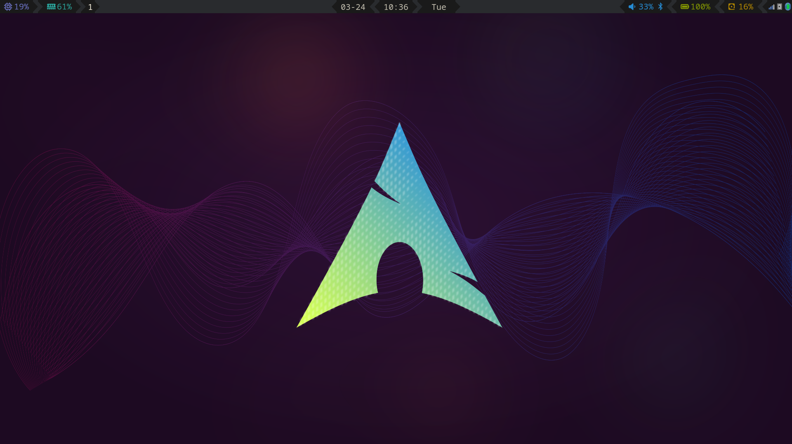
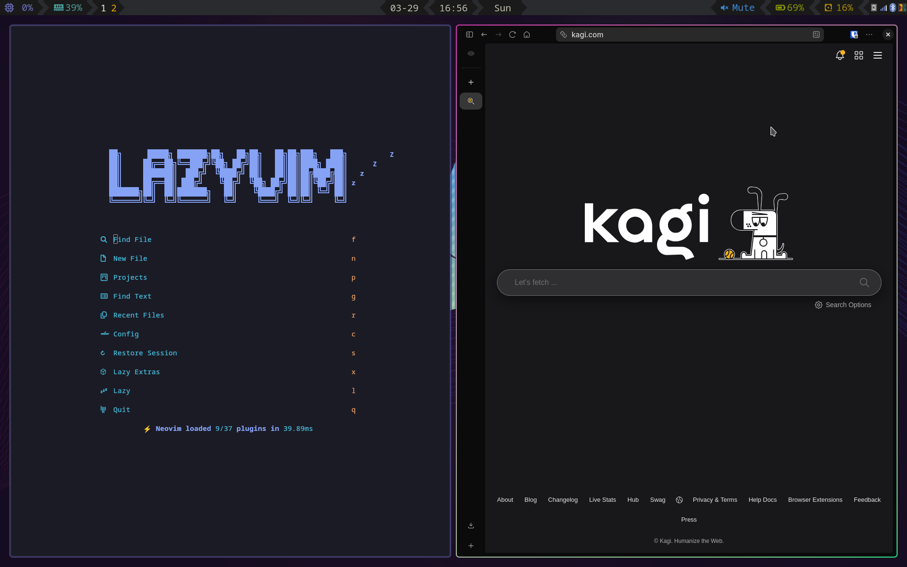

# Arch Linux Installation Guide with Hyprland

<!--toc:start-->
- [Arch Linux Installation Guide with Hyprland](#arch-linux-installation-guide-with-hyprland)
  - [1. Initial Setup](#1-initial-setup)
    - [1.0 Installing Arch Linux](#10-installing-arch-linux)
    - [1.1 Install Essential Packages](#11-install-essential-packages)
    - [1.2 Install Yay (AUR Helper)](#12-install-yay-aur-helper)
    - [1.3 Install Packages with Yay](#13-install-packages-with-yay)
  - [2. Deploying system config](#2-deploying-system-config)
    - [2.1 System specific configuration](#21-system-specific-configuration)
    - [2.2 Deploy oh-my-zsh](#22-deploy-oh-my-zsh)
    - [2.3 Add required home folders](#23-add-required-home-folders)
  - [3. Theming](#3-theming)
    - [3.1 Install Theme files](#31-install-theme-files)
    - [3.2 SDDM Theme (Slice 1.5.1)](#32-sddm-theme-slice-151)
    - [3.3 Install the GTK theme](#33-install-the-gtk-theme)
  - [4. System Configuration](#4-system-configuration)
    - [4.1 Boot Options](#41-boot-options)
    - [4.2 Dependencies](#42-dependencies)
    - [4.3 OneDrive config](#43-onedrive-config)
    - [4.4 Systemd Services](#44-systemd-services)
    - [4.5 Cronjobs](#45-cronjobs)
  - [5. Restore from Backup](#5-restore-from-backup)
    - [5.1 Dependencies](#51-dependencies)
    - [5.2 Mount Borg Backup](#52-mount-borg-backup)
    - [5.3. Deploy automatic backups](#53-deploy-automatic-backups)
  - [6. Virtualization Setup](#6-virtualization-setup)
    - [6.1 Install Virtualization Tools](#61-install-virtualization-tools)
    - [6.2 Starting required services](#62-starting-required-services)
<!--toc:end-->

This guide provides step-by-step instructions for deploying Hyprland to an Arch Linux installation, including package installation, theming, configuration, and backup restoration.

Up to section [4. System Configuration](#4-system-configuration) the guide is supposed to be system and backup agnostic and should work in any system.




The waybar theme is a slightly modified copy of [cjbassi's waybar config](https://github.com/cjbassi/config/tree/master/.config/waybar).

---

## 1. Initial Setup

### 1.0 Installing Arch Linux

This guide isn't prescriptive about how to install Arch Linux, but it requires
the installation of the desktop profile with hyprland when using
[archinstall](github.com/archlinux/archinstall).

### 1.1 Install Essential Packages

```bash
sudo pacman -S --needed git base-devel
```

### 1.2 Install Yay (AUR Helper)

```bash
git clone https://aur.archlinux.org/yay-bin.git
cd yay-bin
makepkg -si
cd ..
rm -rf yay-bin
yay -S yay
yay -Scc
```

### 1.3 Install Packages with Yay

Install the following packages using `yay`:

```bash
yay -S --needed \
  bc \
  bind \
  blueman \
  cliphist \
  dunst \
  fzf \
  git \
  gnome-system-monitor \
  go \
  grimblast-git \
  hyprcursor \
  hyprpaper \
  inotify-tools \
  jq \
  kdeconnect \
  ksnip \
  less \
  lsd \
  ncdu \
  neovim \
  noto-fonts \
  noto-fonts-emoji \
  npm \
  otf-font-awesome \
  pavucontrol \
  plocate \
  pyenv \
  rofi-wayland \
  rsync \
  rust \
  waybar \
  wl-clip-persist \
  xcursor-breeze5 \
  zen-browser-bin \
  zip \
  zsh-fast-syntax-highlighting
```

---

## 2. Deploying system config

Clone this repo and deploy it to `~/.config`

```bash
git clone https://github.com/gchamon/archlinux-system-config
rsync -va ~/archlinux-system-config/ ~/.config
rm -rf ~/archlinux-system-config
```

### 2.1 System specific configuration

System specific configurations reside in `~/.config/hypr/config`. To deploy one config, create a symbolic link for it:

```bash
ln -s ~/.config/hypr/config/nitro.conf ~/.config/hypr/config/current.conf
```

If no system specific configuration applies, deploy the empty config:

```bash
ln -s ~/.config/hypr/config/empty.conf ~/.config/hypr/config/current.conf
```

### 2.2 Deploy oh-my-zsh

Zsh shell relies on `oh-my-zsh` and `powerlevel10k`, which will need to be installed:

```bash
yay -S oh-my-zsh-git zsh-theme-powerlevel10k ttf-meslo-nerd
test -f ~/.zshrc && mv ~/.zshrc{,.bk}
ln -s ~/.config/.zshrc ~/.zshrc
```

There are four preconfigured powerlevel10k prompt styles. Choose one of
`.p10k-classic.zsh`, `.p10k-lean.zsh`, `.p10k-pure.zsh` or `.p10k-rainbow.zsh`
and create a symbolic link to `~/.p10k.zsh`:

```bash
ln -s ~/.config/.p10k-classic.zsh ~/.p10k.zsh
```

There is a fifth powerlevel10k prompt style that is geared towards supporting
tty shells, which is called `.p10k-portable.zsh` and it should be deployed to
the home folder along with the chosen profile:

```bash
ln -s ~/.config/.p10k-portable.zsh /home/gchamon/.p10k-portable.zsh
```

Now change the shell to if necessary:

```bash
chsh -s $(which zsh)
```

### 2.3 Add required home folders

This is for the screenshot utility to work.

```bash
mkdir -p $HOME/Pictures/Screenshots
```

---

## 3. Theming

### 3.1 Install Theme files

```bash
yay -S --needed \
  archlinux-wallpaper \
  gnome-themes-extra \
  qt5-graphicaleffects
```

### 3.2 SDDM Theme (Slice 1.5.1)

Unfortunately the main branch of the slice theme repo isn't compatible with SDDM, making it impossible to just install `sddm-slice-git`.

1. Download the [SDDM Slice theme](https://github.com/EricKotato/sddm-slice/releases/tag/1.5.1).
2. Deploy to SDDM themes directory:

```bash
cd ~/Downloads
tar -xzvf sddm-slice-1.5.1.tar.gz
sudo mv sddm-slice-1.5.1 /usr/share/sddm/themes/slice
```

3. Configure sddm theme:

```bash
cat > /tmp/theme.conf <<EOF
[Theme]
Current=slice
EOF

sudo mkdir -p /etc/sddm.conf.d
sudo mv /tmp/theme.conf /etc/sddm.conf.d
```

### 3.3 Install the GTK theme

1. Install NWG Look

```
yay -S nwg-look
```

2. Configure `Adwaita-dark` in the theme picket. To run the picker, bring up the runner modal with `SUPER+R` and choose `GTK Settings`.

---

## 4. System Configuration

### 4.1 Boot Options

Add the following to your bootloader configuration (e.g., `grub.cfg` or `refind.conf`):

```text
nvidia_drm.modeset=1
```

*(Use this if you're using NVIDIA proprietary drivers, as per the Hyprland master tutorial.)*

### 4.2 Dependencies

```bash
yay -S gnome-keyring onedrive-abraunegg seahorse
```

### 4.3 OneDrive config

```bash
onedrive --sync
```

### 4.4 Systemd Services

Enable and start the following services:

```bash
# User services
for service in gcr-ssh-agent onedrive; do
  systemctl --user enable $service
  systemctl --user start $service
done

# System services
for service in bluetooth; do
  sudo systemctl enable $service
  sudo systemctl start $service
done
```

### 4.5 Cronjobs

Cronjobs are in the `cronjobs/` folder and can be deployed with rsync:

```
sudo rsync -va ./cronjobs/ /etc/
```

---

## 5. Restore from Backup

### 5.1 Dependencies

Install dependencies and add mountpoints in `/etc/fstab` for the NAS:

```bash
yay -S bitwarden borg python-pyfuse3 nfs-utils

sudo mkdir -p /media/storage /media/fast-storage

sudo cat >> /etc/fstab <<EOF
# NAS
192.168.0.5:/media/storage /media/storage  nfs defaults,soft,timeo=30 0 0
192.168.0.5:/media/fast-storage /media/fast-storage nfs defaults,soft,timeo=30 0 0
EOF

sudo systemctl daemon-reload
sudo mount -a
```

### 5.2 Mount Borg Backup

1. Deploy the password following the README at [gchamon/borg-automated-backups](github.com/gchamon/borg-automated-backups).

2. Mount the Borg archives:

First specify the backup and restore paths:

```bash
BORG_BACKUP_PATH=/media/storage/borg-backups/nitro-rev1
RECOVERY_PATH_HOME=$HOME/recovery-home
RECOVERY_PATH_ETC=$HOME/recovery-etc
```

Then mount the latest archives:

```bash
HOME_LATEST_ARCHIVE=$(sudo borg list $BORG_BACKUP_PATH/home --json | jq -r '.archives[-1].archive')
ETC_LATEST_ARCHIVE=$(sudo borg list $BORG_BACKUP_PATH/etc --json | jq -r '.archives[-1].archive')

mkdir -p $RECOVERY_PATH_HOME $RECOVERY_PATH_ETC

sudo borg mount $BORG_BACKUP_PATH/home::$HOME_LATEST_ARCHIVE $RECOVERY_PATH_HOME
sudo borg mount $BORG_BACKUP_PATH/etc::$ETC_LATEST_ARCHIVE $RECOVERY_PATH_ETC
```

3. Restore Specific Directories and Files

Use the following `rsync` commands to explicitly restore the listed directories and files:

  3.1. HOME Directory

```bash
sudo rsync -av {$RECOVERY_PATH_HOME/home,~}/.mozilla/
sudo rsync -av {$RECOVERY_PATH_HOME/home,~}/.zen/
sudo rsync -av {$RECOVERY_PATH_HOME/home,~}/.local/lib/
sudo rsync -av {$RECOVERY_PATH_HOME/home,~}/.ssh/
sudo rsync -av {$RECOVERY_PATH_HOME/home,~}/OneDrive/
sudo rsync -av {$RECOVERY_PATH_HOME/home,~}/Scripts/
sudo rsync -av {$RECOVERY_PATH_HOME/home,~}/.zshenv
```

  3.2. System Configuration Files

```bash
sudo rsync -av {$RECOVERY_PATH_ETC/etc,/etc}/pacman.conf
sudo rsync -av {$RECOVERY_PATH_ETC/etc,/etc}/pacman.d/
```

  3.3. Remove restoration mountpoints

```bash
sudo umount $RECOVERY_PATH_HOME
sudo umount $RECOVERY_PATH_ETC
sudo rm -rf $RECOVERY_PATH_HOME $RECOVERY_PATH_ETC
```

### 5.3. Deploy automatic backups

Use [gchamon/borg-automated-backups](github.com/gchamon/borg-automated-backups)
to redeploy the backup automation. Make sure to increment the `revX` in the
backup, for instance, we used in the example `nitro-rev1`, therefore the next
backup deployment should be `nitro-rev2` after a fresh install. This is so that
I avoid erasing data from previous revisions, which frees me to do lean fresh
installs without risking losing data.

---

## 6. Virtualization Setup

### 6.1 Install Virtualization Tools

```bash
yay -S qemu-desktop libvirt virt-manager dnsmasq
```

### 6.2 Starting required services

Once the `~/Scripts` folder is restored from backup you can just:

```bash
~/Scripts/qemu-services.sh
```

---

This guide assumes a clean Arch Linux installation. Adjust paths and configurations as needed for your specific environment.
