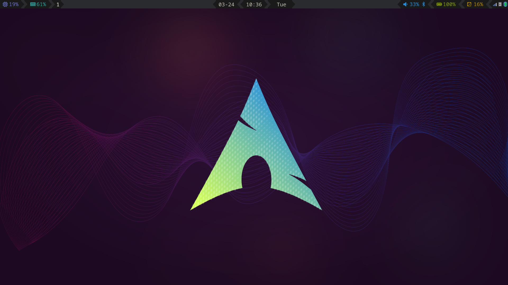
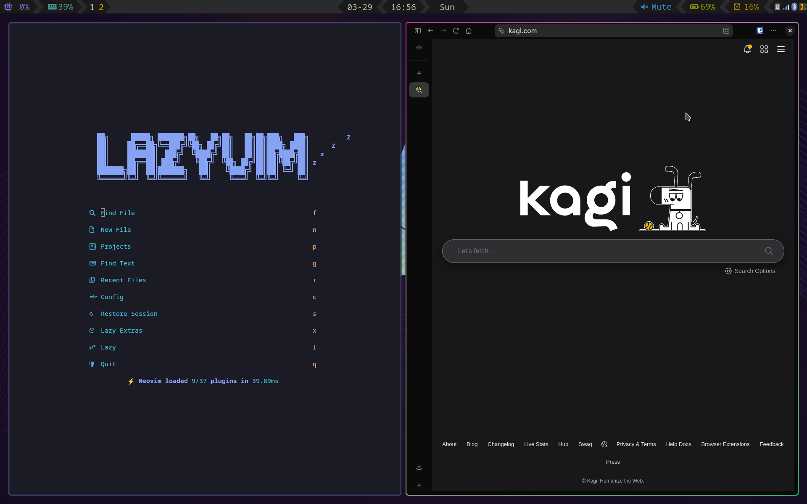

# Archie

Archie is the name of my system and this is its companion guide.

GitLab is the canonical upstream for Archie:
<https://gitlab.com/gabriel.chamon/archie>

GitHub is kept as a read-only mirror of `main` and tags:
<https://github.com/gchamon/archie>

Open merge requests in GitLab. Do not use GitHub pull requests or issues for
contributions to this repository.

Credits to
[cjbassi](https://github.com/cjbassi/config/tree/master/.config/waybar) for the
[waybar](https://github.com/Alexays/Waybar) theme.

Credits to [catppuccin/dunst](https://github.com/catppuccin/dunst) for the
[dunst](https://github.com/dunst-project/dunst) theme.

Credits to [EricKotato/sddm-slice](https://github.com/EricKotato/sddm-slice)
for the [sddm](https://github.com/sddm/sddm) theme.

Credits to
[connorholyday/kitty-snazzy](https://github.com/connorholyday/kitty-snazzy) for
the [kitty](https://github.com/kovidgoyal/kitty) theme.

GTK theme is Adwaita-dark. [Oh-my-zsh](https://github.com/ohmyzsh/ohmyzsh/)
theme is [powerlevel10k](https://github.com/romkatv/powerlevel10k).

Special thanks to the [Arch Linux](https://archlinux.org/) team and the folks
behind [Hyprland](https://hypr.land/).

[NeoVim](https://github.com/neovim/neovim) configuration is provided by
[LazyVim](https://github.com/LazyVim/LazyVim).

## Topics

These are the topics included in this handbook.

For the full documentation workspace, including internal planning material, see
[docs/README.md](docs/README.md).

### [System installation guide](docs/GUIDE.md)

The system installation guide documents necessary steps to get archie up and
running, so start [here](docs/GUIDE.md)!

### [Keyboard shortcuts](docs/KEYBOARD_SHORTCUTS.md)

[Keyboard shortcuts](docs/KEYBOARD_SHORTCUTS.md) documents all the possible keyboard
shortcuts. The information is extracted from hyprland configuration using
[Google's Gemini LLM](https/gemini.google.com).

### [Keyboard customizations](docs/KEYBOARD_CUSTOMIZATIONS.md)

[Keyboard customizations](docs/KEYBOARD_CUSTOMIZATIONS.md) documents the deployment
of xkeyboard-config compatible customizations that makes it easier to type in a
different language than that of the keyboard in use.

### [Backup and Restore](docs/BACKUP_AND_RESTORE.md)

The [Backup and Restore](docs/BACKUP_AND_RESTORE.md) guide isn't intended to be
generally applicable outside my personal environment. It's there for my
personal disaster recovery drills, but could inspire others looking for backup
strategies.

### [Development](docs/DEVELOPMENT.md)

[This document](docs/DEVELOPMENT.md) explains steps to install and configure
tools I need for daily work as a developer.
